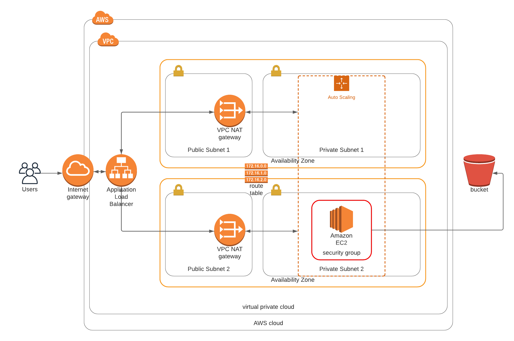
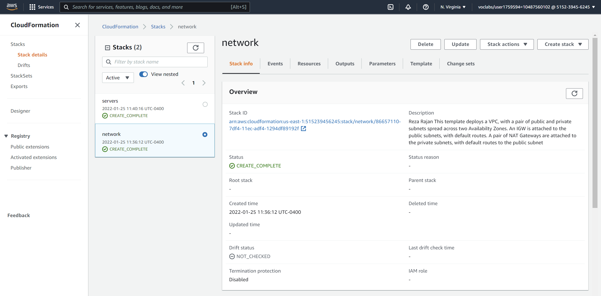
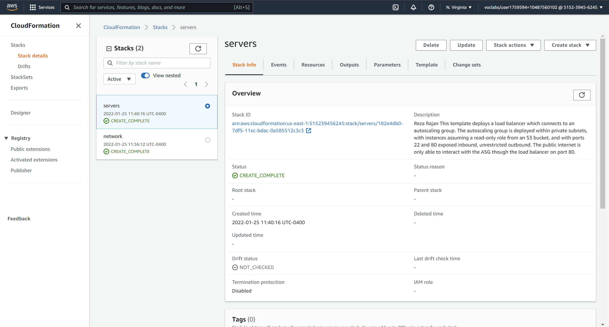
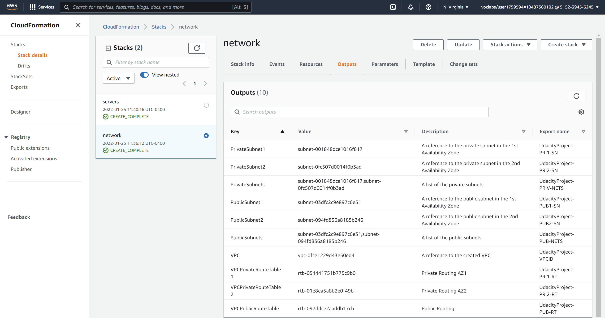
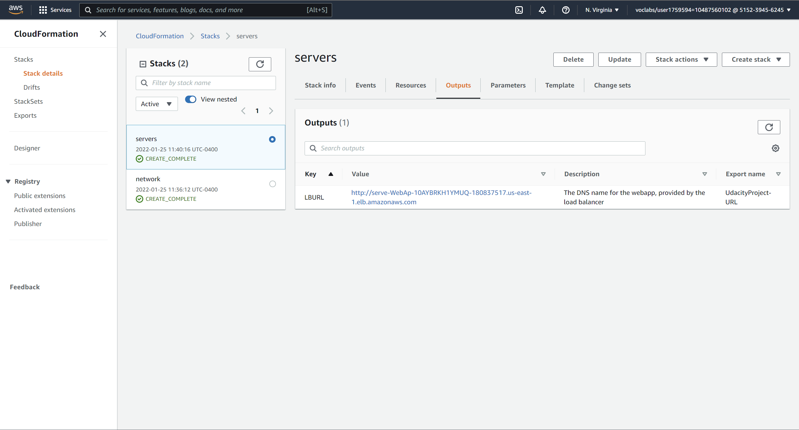

# Project - Static Website Hosting on AWS

The purpose of this project is to deploy a highly-available webapp using AWS Cloudformation

# Summary

A VPC is created, with two public and two private subnets. An AutoScaling Group is deployed within the private subnets
such that each subnet hosts two EC2 instances. The EC2 instances are congfigured with security groups which allow SSH
and HTTP access, the latter being used for hosting the webapp on an apache server. A load balancer sits in front of 
the public subnets, and forwards inbound traffic to the corresponding webservers. Lastly, a Bastion Host is deployed in 
one of the public subnets, for the purpose of connecting to the EC2 instances residing in the private subnets.

Below is the cloud architecture diagram for this project:

## Rubric Points
Below is an outline of how the rubric points have been addressed.

### The Basics
---

*Note:* The steps in this project have been completed entirely using aws cli.

*Parameters*
The cloudformation configuration files are divided into two files:
1. `network.yml`
2. `servers.yml`

*network.yml*

The network configuration contains all resources required to deploy the underlying communication infrastructure: the public and private subnets, routing tables, internet gateways and NATs. The corresponding parameters file is called 
`network-parameters.json` and contains 6 parameters:
1. EnvironmentName
2. VpcCIDR
3. PublicSubnet1CIDR
4. PublicSubnet2CIDR
5. PrivateSubnet1CIDR
6. PrivateSubnet2CIDR

*servers.yml*

The server configuration contains all resources required to run the webapp. This includes security groups, a load balancer, instance profiles (roles), autoscaling groups, launch configurations and the configuration for the Bastion Host.  The corresponding parameters file is called `servers-parameters.json` and contains 4 parameters:
1. EnvironmentName
2. AMI - *machine image*
3. InstanceType - *EC2 instance type*
4. KeyName - *name of the ssh key used to access instances*

In total, there are 9 unique parameters. Note that, of importance is the `KeyName` parameter in the `servers-parameters.json` file - it is imperative that this key be kept outside of the main configuration `servers.yml`, as a security measure.

*Resources*

As per the requirements, a LoadBalancer, Listener, Launch Configuration, AutoScaling Group with health checks, Security Groups (both for the load balancer and webservers) and Target Group are all included in the configuration `servers.yml`.

Below are screenshots of the created stacks:

*Outputs*

The `network.yml` configuration has 10 outputs, which allow the `servers.yml` configuration to reference the underlying networking resources. Output names are prefixed with the `EnvironmentName` parameter.

The `servers.yml` configuration only has a single output, which is the DNS URL produced by the loadbalancer. This output is prefixed with the string **http://**, such that the resulting value is similar to a website link.

Below are screenshots of the stack outputs:

*Working Test*

At the time of submission, the website may be accessed at http://serve-webap-10aybrkh1ymuq-180837517.us-east-1.elb.amazonaws.com/

Below is a screenshot of the test website:

---

### Load Balancer

*Target Group*

The AutoScaling Group and the load balancer's Listener are both associated with a Target Group, called `WebAppTargetGroup` in `servers.yml`.

*Health Check and Listener*

Port 80 is open for both inbound and outbound traffic on the security groups associated with the load balancer and the web servers (`LBSecGroup` and `WebServerSecGroup`, respectively). The load balancer's Listener forwards incoming traffic to port 80 on the target group, and the target group also uses this port to perform health checks on its instances.

---

### Auto-Scaling

*Subnets*

Two private subnets are used for the AutoScaling Group.

*Machine Specs*

The instance type used is a `t3.medium`, which includes 2 vCPUs, and 4 GiB of memory. The instance is also configured to have 10 GB of storage.

*SSH Key*

The SSH key name is kept outside of the `servers.yml` configuration file, and resides in a separate parameters file called `servers-parameters.json`, as a security measure. The `KeyName` property is still kept, however, as a means of the Bastion Host to be able to connect to the instance. For the purposes of this project, the actual name of the key is uploaded to the GitHub repository in the parameters file, since this key is only transient.

---

### Bonus

*Output*

A total of 11 outputs of exported: 10 from `networks.yml` and 1 from `servers.yml`.

*Bastion Host*

A Bastion Host is included as a means of accessing the instances in the private subnets, whether it be for debugging or testing individual configurations. It is configured with a `t2.micro` instance type, since it is a low-spec machine which more than suites the needs of a Bastion Host.